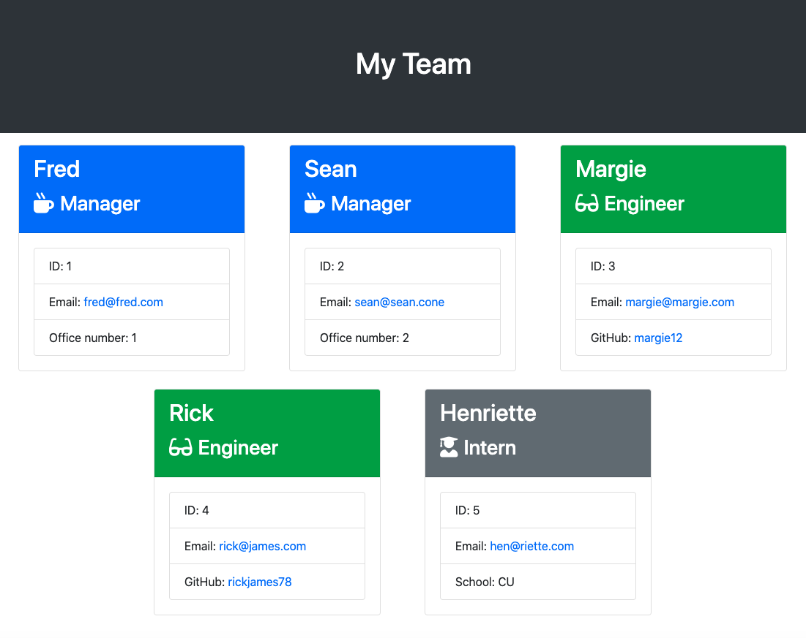

# Team Profile Generator 

[](https://www.youtube.com/watch?v=5C208Rxta2o)

[Link to walkthrough video for Team Profile Generator on YouTube](https://www.youtube.com/watch?v=5C208Rxta2o)

## Description

This Team Profile Generator is a command-line application that dynamically generates a team profile from a user's input using the Inquirer package. The user is prompted for information about their team, and a webpage displaying the user's team's basic information is created for quick access to email addresses and GitHub profiles.



## Installation

To install project dependencies run: 

```
npm i
```

## Tests

To run tests run: 

```
npm run test
```

This Team Profile Generator uses Jest to run unit tests.

## Usage

Use the app by downloading it, and run it by typing the following on the command line:
```
node index.js
```
You will be prompted to select whether the employee is a Manager, Engineer or Intern. Once you have made the selection, you will be prompted to answer a few more questions and then asked if you would like to add more employees. Add as many as you like.

## License

This application is covered under the MIT license.

## Contributing

Submit a pull request if you would like to contribute.

## Questions
Feel free to email me at seandoesitbetter@gmail.com with any questions.

Check out my GitHub profile: [seanc0ne](https://www.github.com/seanc0ne)